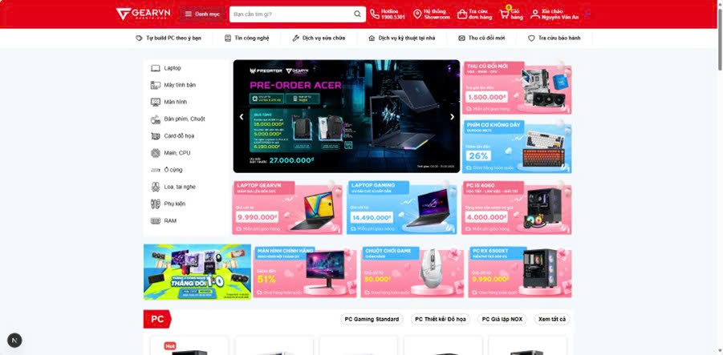
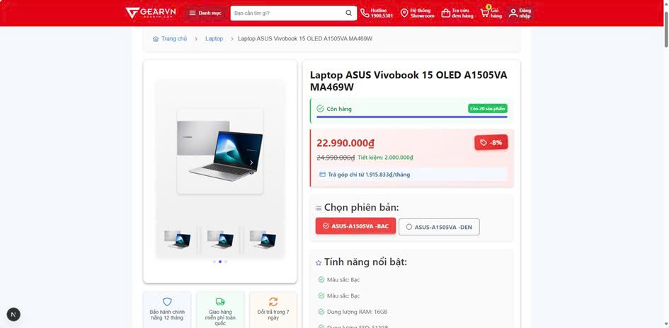
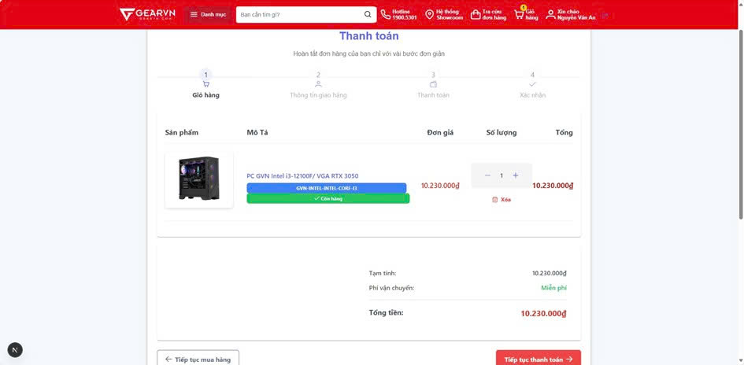
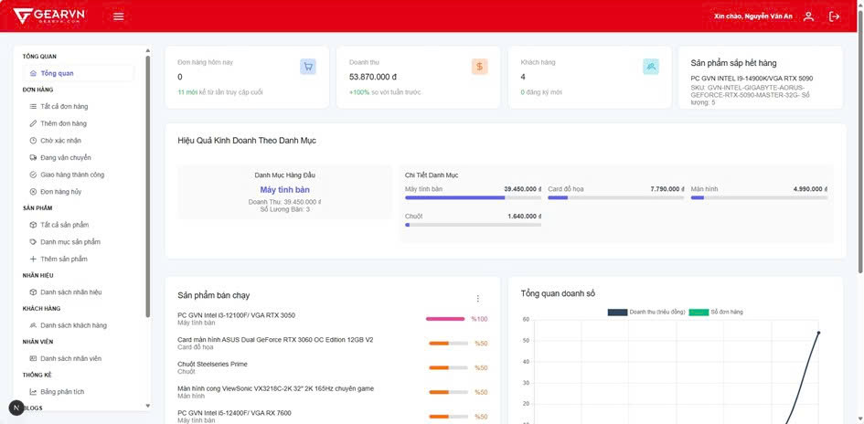
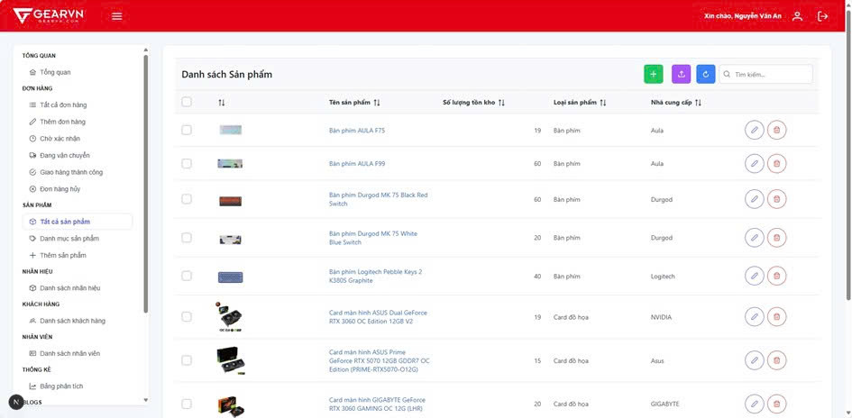
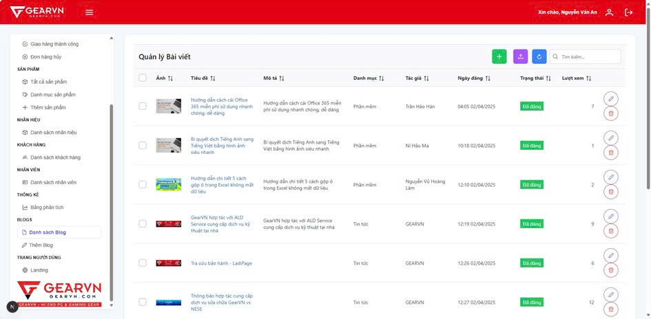

# 💻 PC Online Store

A full-stack **e-commerce web application** for selling computers, accessories, and components.  
Developed using **ReactJS**, **Node.js (Express)**, and **MySQL** as part of a university project at  
**Hung Yen University of Technology and Education**.

---

## 🧭 Overview

The project simulates an online computer store with two main modules:

- **User Module** – Allows customers to browse, search, and purchase products online.
- **Admin Module** – Enables administrators to manage products, orders, customers, and blog posts.

### 🎯 Objectives
- Build a modern, responsive, and user-friendly web application.
- Apply ReactJS and RESTful API principles for seamless data communication.
- Implement **JWT authentication** for secure login.
- Manage all data (products, orders, users, blogs) via a **MySQL database**.
- Support CRUD operations and data visualization for analytics.

---

## 🗂️ Folder Structure
```bash
PCOnlineStore/
│
├── backend/ # Express.js + MySQL API
├── frontend/ # ReactJS interface for users & admins
├── demo/ # Screenshots for report & README
│ ├── AdminPage/
│ │ ├── AdminDashBoard.jpg
│ │ ├── ProductManagementPage.jpg
│ │ ├── BlogManagementPage.jpg
│ │ └── OrderList.jpg
│ └── UserPage/
│ ├── MainStorePage.jpg
│ ├── ProductDetailPage.jpg
│ ├── CartPage.jpg
│ └── PaymentPage.jpg
│
├── database.sql # Database schema & initial data
├── package-lock.json
├── .gitignore
└── README.md
```
---

## ⚙️ Technologies Used

### 🖥️ Frontend
- **ReactJS** – Component-based UI development  
- **React Router DOM** – Page navigation  
- **Axios** – API communication  
- **Tailwind CSS / PrimeReact** – Styling & components  
- **JWT** – Authentication handling  

### 🧩 Backend
- **Node.js + Express.js** – RESTful API  
- **MySQL** – Relational database  
- **Multer + Cloudinary SDK** – Image upload & hosting  
- **jsonwebtoken** – Access token management  

---

## 🗄️ Database Overview

The system uses **MySQL** to store all e-commerce data.

| Table | Description |
|-------|--------------|
| `users` | User & admin information |
| `products`, `product_variants` | Product data & variations |
| `orders`, `order_items` | Order management |
| `categories`, `brands` | Product classification |
| `blogs`, `tags` | News & articles |
| `cart`, `payment_methods` | Shopping & checkout |
| `product_images`, `specifications` | Images & tech specs |

Full schema available in [`database.sql`](./database.sql).

---

## 🌐 Key Features

### 👤 User Module
- Browse and filter computer products  
- View product details & specifications  
- Add to cart and place orders  
- Manage shipping addresses  
- Track orders and view order history  
- Read blog posts and tech news  

### 🧑‍💼 Admin Module
- Secure admin login via JWT  
- Manage products, categories, and brands  
- Handle orders by status (Pending, Shipping, Completed, Canceled)  
- Manage customer and employee information  
- Write and publish blog posts  
- Dashboard with sales statistics and product analytics  

---

## 🚀 Installation Guide

### 1️⃣ Clone Repository
```bash
git clone https://github.com/Qhuy204/PCOnlineStore.git
cd PCOnlineStore
```
### 2️⃣ Setup Backend
```bash
Copy code
cd backend
npm install
node server.js
```
### ⚠️ Import the database before running:
```bash
Copy code
mysql -u root -p < ../database.sql
```
### 3️⃣ Setup Frontend
```bash
Copy code
cd ../frontend
npm install
npm start
```
### 4️⃣ Access the App
- User site: http://localhost:3000
- Admin dashboard: http://localhost:3000/admin
- API server: http://localhost:5000
---
## 📸 Demo Screenshots

### 🛍️ User Pages
| Page | Screenshot |
|------|-------------|
| **Home** |  |
| **Product Details** |  |
| **Cart / Checkout** |  |
| **Blog** |  |

---

### 🧑‍💼 Admin Pages
| Page | Screenshot |
|------|-------------|
| **Dashboard** |  |
| **Product Management** |  |
| **Order List** |  |
| **Blog Management** |  |

---

## 🔐 Authentication Workflow

1. User or admin logs in → server generates a **JWT token**  
2. Token is stored in **localStorage** or **cookies**  
3. Protected routes verify token validity via middleware  
4. Expired or invalid tokens redirect back to the **login page**

---

## 🧪 Testing

Testing was performed locally using:

- Manual UI validation on React pages  
- API testing with **Postman**  
- CRUD operations for **users, products, and orders**  
- Integration tests for **order checkout** and **authentication**

---

## 📈 Future Improvements

- Integrate online payment (**PayPal**, **MoMo**)  
- Add **email verification** and **password recovery**  
- Optimize **mobile UX/UI** and page load speed  
- Implement **real-time dashboard** for analytics  
- Improve **security** and **scalability** with cloud hosting  

---

## 👨‍💻 Author

**Trương Quốc Huy**  
Final-year Student – AI & Data Science  
**Hung Yen University of Technology and Education**

📧 **truongquochuy234@gmail.com**  
🔗 [github.com/Qhuy204](https://github.com/Qhuy204)

---

© 2025 – **PC Online Store Project**
